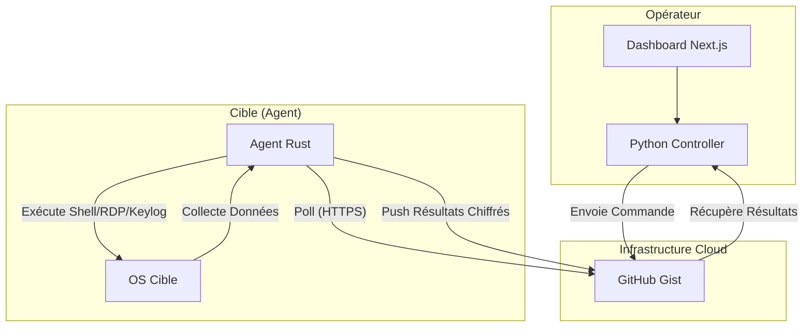

# 🧪 Virogolie : Framework C2 de Nouvelle Génération


**Virogolie** est un framework de Command & Control (C2) sophistiqué conçu pour démontrer des concepts avancés de cybersécurité offensive et de programmation système. Utilisant GitHub Gists comme canal de communication furtif, il combine la puissance de **Rust** pour les implants (agents) et la flexibilité de **Python/Next.js** pour l'orchestration.

---

## 🚀 Vision du Projet

L'objectif de Virogolie est de fournir une plateforme robuste et extensible pour simuler des attaques APT (Advanced Persistent Threat) dans un cadre éducatif et de recherche. Le framework se distingue par son utilisation créative de services légitimes (Gists) pour contourner les inspections réseau traditionnelles.

---

## ✨ Fonctionnalités Clés

### 🕵️‍♂️ Implant Rust (Agent Stealth)

- **Communications Chiffrées** : Protocoles de communication via HTTPS vers GitHub Gists.
- **Exécution Shell distante** : Exécution de commandes système avec retour de résultat.
- **Collecte de Télémétrie** : monitoring en temps réel de l'état du processeur, de la mémoire et de l'uptime.
- **Keylogger furtif (Windows)** : Capture de frappes clavier avec horodatage détaillé.
- **Détournement RDP (Windows)** : Activation et configuration à distance des accès Remote Desktop.
- **Vol d'Identifiants Navigateurs (Windows)** : Extraction et déchiffrement des mots de passe (Firefox, Chrome/Edge via Bypass ABE).
- **Escalade de Privilèges (Windows)** : Passage d'Administrateur à SYSTEM via Token Stealing (Impersonation de `winlogon.exe`).
- **Persistance Automatique** : Installation silencieuse (Startup Windows, systemd/crontab Linux).
- **Architecture Modulaire** : Compilation optimisée (Release) avec une empreinte mémoire minimale (< 15MB).

### 🕹️ Contrôleur Python & Dashboard

- **Dashboard Next.js Premium** : Interface moderne et responsive pour la gestion des bots.
- **Interface CLI Interactive** : Terminal de contrôle (C2Shell) depuis Python pour piloter les agents de façon textuelle.
- **Gestionnaire de Tâches** : Mise en file d'attente des commandes avec identifiants uniques (UUID).
- **Géolocalisation des Cibles** : Déduction de la position géographique des agents via les paramètres régionaux (GeoIDs Windows).
- **Audit Tooling** : Visualisation des logs et des résultats de commandes de manière structurée.
- **Kill Switch d'Urgence (Nettoyage Total)** : Commande globale de self-destruct qui efface toutes les traces de l'agent sur l'hôte (binaires, persistance, payloads) et nettoie GitHub.

### 🔐 Sécurité & Cryptographie

- **Asymmetric Encryption** : Utilisation de **RSA-2048** pour la signature des commandes et le chiffrement des résultats.
- **Symmetric Encryption** : Chiffrement **AES-256-GCM** pour garantir l'intégrité et la confidentialité des échanges.
- **Data Obfuscation** : Compression Gzip et encodage Base64 pour mimiquer des logs système légitimes.

---

## 🏗️ Architecture du Système

Le diagramme suivant illustre le flux de données via le canal covert GitHub Gist :



---

## 📖 Structure du Projet

```text
TSEC-911-STG_6/
├── c2_agent/          # Implant écrit en Rust (Stealth & Speed)
├── controller.py      # Serveur API Flask + Gestionnaire GitHub
├── frontend/          # Dashboard Next.js (Visualisation & Control)
├── setup.sh           # Script d'installation automatisé
├── .env.example       # Modèle de configuration des secrets (Token GitHub, Gist ID)
└── requirements.txt   # Dépendances Python
```

---

## 🛠️ Installation & Démarrage

### 1. Pré-requis

- Rust & Cargo
- Python 3.9+
- Node.js & npm
- Un jeton d'accès GitHub (PAT) avec accès aux Gists.

### 2. Configuration

Renommez `.env.example` en `.env` et remplissez les variables :

```env
GITHUB_TOKEN=votre_token_github
GIST_ID=votre_id_de_gist
AES_KEY_PATH=aes_key.txt
PRIVATE_KEY_PATH=private_key.pem
```

### 3. Lancer le Contrôleur

```bash
python3 -m venv venv
source venv/bin/activate
pip install -r requirements.txt
python3 controller.py
```

### 4. Compiler l'Agent

```bash
cd c2_agent
cargo build --release
```

---

_Réalisé avec passion pour l'ingénierie système et la sécurité offensive._
